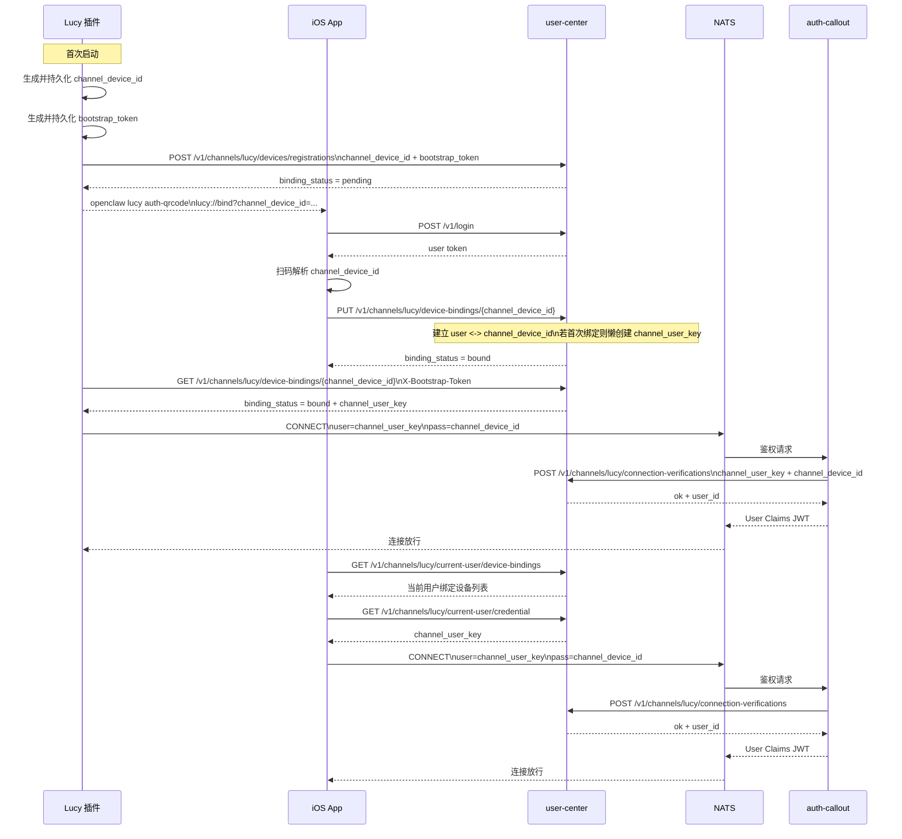

# Lucy 鉴权绑定整合文档

本文把当前已经落地的 Lucy 鉴权绑定方案收敛成一份统一说明，包含：

- 统一术语
- 模块职责
- 主流程
- 模型配置下发与自动重启补充链路
- 一张时序图

后续如果插件、iOS App、`npc-im-server`、`user-center` 之间出现理解偏差，以本文为准。

## 1. 统一术语

- `channel_user_key`
  - 旧的 `apikey`
  - 本质没变，只是统一改名

- `channel_device_id`
  - 旧的 `device_id`
  - 本质没变，只是统一改名

- `bootstrap_token`
  - 设备 bootstrap 阶段自证明凭据
  - 只由插件自己持有
  - 服务端只保存其 hash

- 对 NATS 来说：
  - `username = channel_user_key`
  - `password = channel_device_id`

## 2. 各模块职责

### `user-center`

负责：

- 保存 `channel_user_key`
- 保存 `channel_device_id`
- 保存 `bootstrap_token_hash`
- 保存用户与设备的绑定关系
- 提供注册、绑定、查询、连接校验接口
- 为已登录 Lucy 用户提供模型配置接口
- 懒创建并复用 Lucy / Cephalon 专用 API key

不负责：

- 不负责 NATS 长连接
- 不负责消息收发
- 不负责插件运行逻辑

### Lucy 插件

负责：

- 生成并持久化 `channel_device_id`
- 生成并持久化 `bootstrap_token`
- 向 `user-center` 注册设备
- 轮询绑定状态
- 拿到绑定后的 `channel_user_key`
- 用 `channel_user_key + channel_device_id` 连接 NATS
- 在插件内部注册 `providerId = cephalon`
- 接收 App 下发的模型配置控制消息
- 写入 OpenClaw 的 `models.providers.cephalon.*`
- 写入 `agents.defaults.model.primary`
- 自动触发 `openclaw gateway restart`
- 在重启前后发出 machine event 与 presence 信号

### iOS App

负责：

- 登录 `user-center`
- 扫描插件提供的绑定二维码
- 绑定 Lucy 设备
- 查询当前用户已绑定设备
- 查询当前用户自己的 `channel_user_key`
- 查询当前用户的 Lucy 模型配置
- 渲染当前可选模型列表（当前只有 `kimi-k2.5`）
- 下发 `provision_model` 控制消息
- 感知“正在重启 / 即将上线 / 已恢复”
- 如需要，自己用 `channel_user_key + channel_device_id` 连接 NATS

### `npc-im-server` / `auth-callout`

负责：

- 从 NATS 握手里读取 `username/password`
- 将其解释为 `channel_user_key/channel_device_id`
- 调 `user-center` 的 Lucy 校验接口
- 按返回的 `user_id` 签发最小权限

不负责：

- 不保存绑定关系
- 不维护设备状态真相

## 3. 主流程

### 第一步：插件创建设备身份

Lucy 插件首次启动时：

1. 生成并持久化 `channel_device_id`
2. 生成并持久化 `bootstrap_token`

### 第二步：插件向 `user-center` 注册设备

Lucy 插件调用：

- `POST /v1/channels/lucy/devices/registrations`

请求体：

```json
{
  "channel_device_id": "2031655882831360000",
  "bootstrap_token": "cbt_xxx"
}
```

`user-center` 只记录：

- `channel_device_id`
- `bootstrap_token_hash`
- 当前 `binding_status = pending`

### 第三步：用户在 iOS App 登录 `user-center`

iOS App 调用：

- `POST /v1/login`

拿到普通用户登录 token。  
后续 App 用这个 token 去调 Lucy 绑定相关接口。

### 第四步：插件输出绑定二维码

Lucy 插件通过命令输出：

- `openclaw lucy auth-qrcode`
- `openclaw lucy reset-state`
  - 清空 Lucy 本地持久化的设备状态
  - 重新生成一套新的 `channel_device_id/bootstrap_token`
  - 直接输出新的绑定二维码
  - 不删除 `user-center` 上旧设备的服务端绑定
  - 如果 Lucy gateway 已在运行，执行后需要 reload 或 restart 才会切到新设备身份

开发环境也可以直接运行：

- `pnpm --filter @hzttt/lucy auth-qrcode`
- `reset-state` 当前通过 OpenClaw 的命令入口执行，不单独提供包内脚本

二维码内容建议为：

```text
lucy://bind?channel_device_id=2031655882831360000
```

### 第四点五步：插件可选输出 BLE 配对导出

为了给本地 BLE 配网服务一个稳定、脱敏的交接面，Lucy 还会在本地 state 目录写出：

- `lucy/pairing-info.json`

当前导出内容只包含：

- `channel`
- `channel_device_id`
- `binding_status`
- `created_at_ms`

不会包含：

- `bootstrap_token`
- `channel_user_key`

这样 `blue-wifi` 之类的本地服务可以把 `channel_device_id` 通过 BLE 直接交给 App，作为扫码之外的另一种配对入口，但绑定真相仍然在 `user-center`。

### 第五步：用户在 App 里扫码或通过 BLE 读取设备并绑定

iOS App 可以通过两种方式拿到：

- `channel_device_id`

1. 扫码 `lucy://bind?channel_device_id=...`
2. 连接本地 BLE 服务并读取 Lucy 的脱敏 pairing export

iOS App 调用：

- `PUT /v1/channels/lucy/device-bindings/{channel_device_id}`

`user-center` 建立：

- `user <-> channel_device_id`

如果这个用户第一次绑定 Lucy 设备，则懒创建唯一的：

- `channel_user_key`

### 第六步：插件轮询自己的绑定状态

Lucy 插件调用：

- `GET /v1/channels/lucy/device-bindings/{channel_device_id}`

并带请求头：

- `X-Bootstrap-Token: <bootstrap_token>`

如果还未绑定，只返回：

- `binding_status = pending`

如果已经绑定，则返回：

- `binding_status = bound`
- `channel_user_key`

### 第七步：Lucy 插件正式连接 NATS

Lucy 插件用：

- `user = channel_user_key`
- `pass = channel_device_id`

建立 NATS 连接。

### 第八步：iOS App 如需直连 NATS

iOS App 先调用：

- `GET /v1/channels/lucy/current-user/device-bindings`
- `GET /v1/channels/lucy/current-user/credential`

拿到：

- 当前用户已绑定的 `channel_device_id`
- 当前用户唯一的 `channel_user_key`

然后同样使用：

- `user = channel_user_key`
- `pass = channel_device_id`

连接 NATS。

### 第八点五步：App 获取 Lucy 模型配置

已登录的 App 调用：

- `GET /v1/channels/lucy/current-user/model-config`

这个接口返回：

- `provider_id`
- `api_key`
- `base_url`
- `default_model_id`
- `models[]`

约束：

- 当前 `provider_id` 固定为 `cephalon`
- 当前 `default_model_id` 固定为 `kimi-k2.5`
- `models[]` 当前只返回 `kimi-k2.5`，但语义上它是未来多模型入口
- `base_url` 必须由 user-center 按当前环境返回，不能在客户端或插件里写死 `prod` / `test`
- 该接口第一次访问时会懒创建一枚固定命名的 Lucy 专用 API key，后续重复复用

### 第八点六步：App 下发模型配置并触发自动重启

App 通过当前设备的：

- `client = {subjectPrefix}.{channelUserKey}.{channelDeviceId}.client`

发送一条控制消息：

```json
{
  "version": 3,
  "kind": "provision_model",
  "messageId": "1773582494346106545",
  "timestamp": 1773582494346,
  "channelUserKey": "cuk_xxx",
  "channelDeviceId": "2031655882831360000",
  "provision": {
    "providerId": "cephalon",
    "modelId": "kimi-k2.5",
    "apiKey": "sk_xxx",
    "baseUrl": "https://test.unicorn.org.cn/cephalon/user-center/v1/model",
    "switchDefaultModel": true,
    "restartRequested": true
  }
}
```

Lucy 插件收到后：

1. 写入 `models.providers.cephalon`
2. 写入 `agents.defaults.model.primary = "cephalon/kimi-k2.5"`
3. 如果已启用 `plugins.entries.multimodal-rag`，且其 `ollama.baseUrl` 已配置为绝对 `cephalon ... /v1/model` URL，或 `whisper.zhipuApiBaseUrl` 已配置为绝对 `cephalon ... /v1/model` / `cephalon ... /v1/model/v1` URL，则把同一份 `apiKey` 额外写入对应的 `ollama.apiKey` / `whisper.zhipuApiKey`
4. 非 cephalon URL、相对路径、或未启用的 `multimodal-rag` 配置不会被自动改写
5. 发 `config.updated`
6. 发 `restart.scheduled`
7. 自动执行 `openclaw gateway restart`
8. 关闭前发 `_discover` offline
9. 启动成功后恢复 `_discover` online
10. 再发 `restart.completed`

### 第九步：`auth-callout` 校验连接

`npc-im-server/auth-callout` 从 NATS 握手里取：

- `username -> channel_user_key`
- `password -> channel_device_id`

然后调用：

- `POST /v1/channels/lucy/connection-verifications`

请求体：

```json
{
  "channel_user_key": "cuk_xxx",
  "channel_device_id": "2031655882831360000"
}
```

`user-center` 校验这组组合是否合法。  
如果合法，返回：

```json
{
  "ok": true,
  "user_id": "2032791907809468416",
  "channel_device_id": "2031655882831360000"
}
```

`auth-callout` 再基于这个 `user_id` 给 NATS 签发最小权限。

## 4. 时序图



## 5. 当前实现上的关键结论

- `channel_user_key` 和 `channel_device_id` 是旧 `apikey/device_id` 的统一重命名，不是另一套全新身份模型
- 插件和 App 都必须最终收敛到同一套 NATS 握手：
  - `user = channel_user_key`
  - `pass = channel_device_id`
- `auth-callout` 不再自己伪造 NPC 身份映射，而是必须以 `user-center` 的校验结果为准
- `bootstrap_token` 只用于插件 bootstrap 阶段，不进入 NATS 握手
- 开发环境下也可以直接运行 Lucy 包脚本命令：`pnpm --filter @hzttt/lucy auth-qrcode`

## 6. 仍需注意的实现细节

- `user-center` 当前业务错误大多仍是 HTTP 200 + `code/msg/data` 包装，客户端不能只看 HTTP 状态码
- 错误的 `bootstrap_token` 当前返回文案仍偏旧，逻辑上是拒绝成功的，但提示语还不够精确
- App 侧 machine event decoder 需要兼容当前线上字段 `channelDeviceId`，不能只兼容旧的 `deviceId`
- 即使绑定、NATS 握手和 `auth-callout` 都已经打通，OpenClaw 仍然必须配置一个可用的模型 provider；否则链路会停在 `inbound.accepted` / `assistant.start` 之前或期间，并在 OpenClaw 日志里表现为 provider/auth/model 错误
