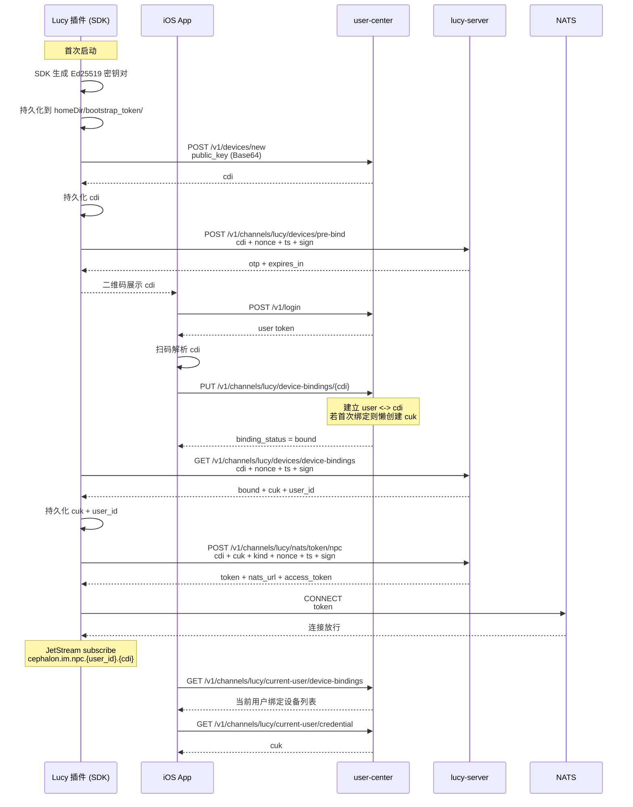

# Lucy 鉴权绑定整合文档

本文把当前已经落地的 Lucy 鉴权绑定方案收敛成一份统一说明，包含：

- 统一术语
- 模块职责
- 主流程
- 模型配置下发与自动重启补充链路
- 一张时序图

后续如果插件、iOS App、`npc-im-server`、`user-center` 之间出现理解偏差，以本文为准。

## 1. 统一术语

- `cdi`（channel_device_id）
  - 由 SDK 通过 Ed25519 公钥向 `user-center` 注册后获得
  - 设备的长期标识

- `cuk`（channel_user_key）
  - 当前用户在 Lucy channel 下唯一的长期凭据
  - 第一次成功绑定设备时由 `user-center` 懒创建

- `user_id`
  - 绑定成功后由 `user-center` 返回的用户标识
  - 用于构造 NATS subject

- Ed25519 密钥对
  - SDK 在 `homeDir/bootstrap_token/` 下持久化
  - 私钥：`id_ed25519`（PKCS#8 PEM）
  - 公钥：`id_ed25519.pub`（32 字节原始公钥的标准 Base64）
  - 用于设备注册和所有 HTTP 请求的签名

- 对 NATS 来说：
  - 不再使用 username/password
  - 通过 Ed25519 签名向 `lucy-server` 换取短期 NATS token
  - 用 token 连接 NATS

## 2. 各模块职责

### `user-center`

负责：

- 接收 Ed25519 公钥注册新设备，返回 `cdi`
- 保存用户与设备的绑定关系
- 提供 pre-bind OTP、绑定查询接口
- 为已登录 Lucy 用户提供模型配置接口
- 懒创建并复用 Lucy / Cephalon 专用 API key

不负责：

- 不负责 NATS 长连接
- 不负责消息收发
- 不负责插件运行逻辑

### `lucy-server`

负责：

- pre-bind OTP 签发
- 设备绑定状态查询（带 Ed25519 签名验证）
- NATS token 换取（带 Ed25519 签名验证）

### Lucy 插件（使用 `lucy-im-sdk-nodejs`）

负责：

- 通过 SDK 生成并持久化 Ed25519 密钥对
- 通过 SDK 向 `user-center` 注册设备获取 `cdi`
- 通过 SDK 执行 pre-bind（获取 OTP）、轮询绑定
- 通过 SDK 用签名换取 NATS token 并连接
- 通过 SDK 的 JetStream Pull Consumer 收发消息
- SDK 内置 presence（_discover 上下线、heartbeat、ping reply）
- 在插件内部注册 `providerId = cephalon`
- 接收 App 下发的模型配置控制消息
- 写入 OpenClaw 的 `models.providers.cephalon.*`
- 写入 `agents.defaults.model.primary`
- 自动触发 `openclaw gateway restart`

### iOS App

负责：

- 登录 `user-center`
- 扫描插件提供的绑定二维码（含 `cdi`）
- 绑定 Lucy 设备
- 查询当前用户已绑定设备
- 查询当前用户自己的 `channel_user_key`
- 查询当前用户的 Lucy 模型配置
- 渲染当前可选模型列表（当前只有 `kimi-k2.5`）
- 下发 `provision_model` 控制消息
- 如需要，自己连接 NATS（App 侧的连接方式由 `lucy-im-sdk-kotlin` 提供）

### `npc-im-server` / `auth-callout`

负责：

- 验证 NATS token 的有效性
- 按返回的 `user_id` 签发最小权限

不负责：

- 不保存绑定关系
- 不维护设备状态真相

## 3. 主流程

### 第一步：SDK 初始化设备身份

Lucy 插件首次启动时，SDK 自动：

1. 在 `homeDir/bootstrap_token/` 下生成 Ed25519 密钥对
2. 将 32 字节原始公钥（Base64）发送到 `user-center` 注册
3. 获得 `cdi` 并持久化到 `homeDir/channel_ids/cdi`

### 第二步：绑定流程

如果 SDK `init()` 返回 `PendingBind`：

1. 调用 `client.preBind()` 获取 OTP（一次性密码）
2. 在二维码中展示 OTP 或 `cdi`，供 App 扫描
3. 调用 `client.pollBinding()` 轮询绑定结果
4. 绑定成功后，SDK 自动持久化 `cuk` 和 `user_id`

### 第三步：用户在 iOS App 登录并绑定

iOS App：

1. 调用 `POST /v1/login` 获取用户 token
2. 扫描二维码获取 `cdi`
3. 调用 `PUT /v1/channels/lucy/device-bindings/{cdi}` 完成绑定
4. `user-center` 建立 `user <-> cdi` 关系，若首次绑定则懒创建 `cuk`

### 第四步：SDK 连接 NATS

SDK `connect()` 流程：

1. 构造签名参数（`cdi`, `kind`, `nonce`, `ts`, `cuk`）
2. 用 Ed25519 私钥签名
3. 向 `lucy-server` 的 `/v1/channels/lucy/nats/token/npc` 换取 NATS token
4. 用 token 连接 NATS（服务端返回 `nats_url`）
5. SDK 自动初始化 JetStream client
6. SDK 自动启动 presence（`kind=lucy` 时）

### 第四点五步：插件可选输出 BLE 配对导出

Lucy 在本地 state 目录写出 `pairing-info.json`，供 `blue-wifi` 等本地服务读取。

当前导出内容只包含：

- `channel`
- `cdi`（作为 `channel_device_id` 字段）
- `binding_status`
- `created_at_ms`

不会包含密钥或 `cuk`。

### 第五步：消息收发

使用 JetStream Pull Consumer：

- **订阅（收消息）**：`cephalon.im.npc.<user_id>.<cdi>`
  - Stream: `IM_NPC`
  - Durable: `npc-<cdi>`
  - Explicit Ack，180s ack_wait，24h 回溯窗口
- **发布（发消息）**：`cephalon.im.user.<user_id>`
  - JetStream publish

### 第五点五步：App 获取 Lucy 模型配置

已登录的 App 调用：

- `GET /v1/channels/lucy/current-user/model-config`

返回 `provider_id`、`api_key`、`base_url`、`default_model_id`、`models[]`。

### 第五点六步：App 下发模型配置并触发自动重启

App 通过 JetStream 发送 `version = 3 / kind = provision_model` 控制消息。

Lucy 插件收到后：

1. 写入 `models.providers.cephalon`
2. 写入 `agents.defaults.model.primary = "cephalon/kimi-k2.5"`
3. 如果已启用 `plugins.entries.multimodal-rag`，且其 `ollama.baseUrl` 或 `whisper.zhipuApiBaseUrl` 已配置为绝对 `cephalon .../v1/model` URL，则同步写入对应的 `apiKey`
4. 发 `config.updated`
5. 发 `restart.scheduled`
6. 自动执行 `openclaw gateway restart`
7. 启动成功后发 `restart.completed`

## 4. 时序图



## 5. 当前实现上的关键结论

- 所有 HTTP 请求（除设备注册外）都需要 Ed25519 签名
- 签名协议：按 key ASCII 排序的 `k=v&k=v` 格式，用 Ed25519 私钥签名后 Base64 编码
- NATS 连接不再使用 username/password，而是通过签名换取的短期 token
- 消息收发使用 JetStream（可靠投递），不再使用 Core NATS 订阅
- Presence（上下线、heartbeat、ping reply）由 SDK 内部处理，应用层不需要额外逻辑
- SDK 工作目录默认为 `/var/lib/lucy/identity/`

## 6. SDK 存储布局

```
/var/lib/lucy/identity/
├── bootstrap_token/
│   ├── id_ed25519          # Ed25519 私钥 (PKCS#8 PEM)
│   └── id_ed25519.pub      # 32 字节公钥 (Base64)
└── channel_ids/
    ├── cdi                 # 设备标识
    ├── cuk                 # channel_user_key
    └── user_id             # 绑定后的用户标识
```
