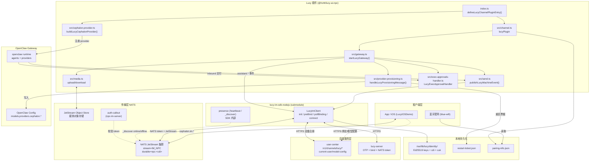
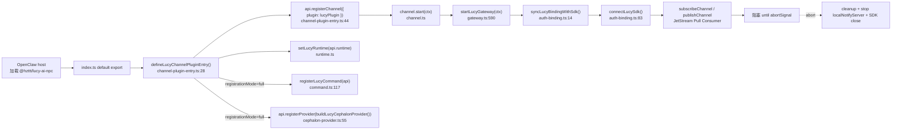
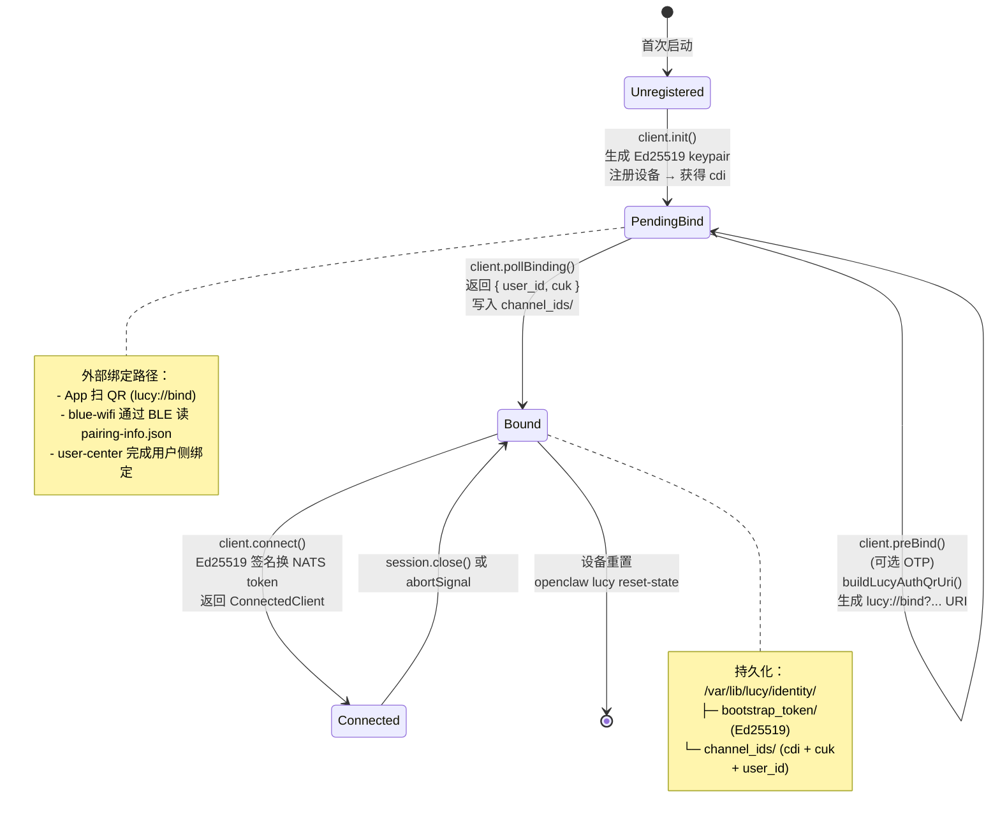
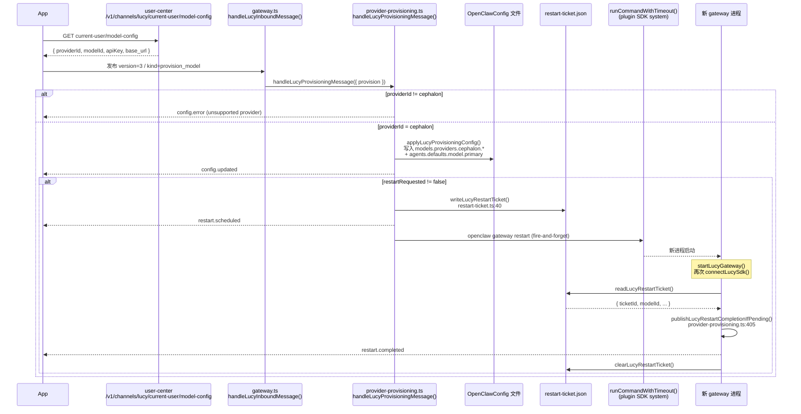
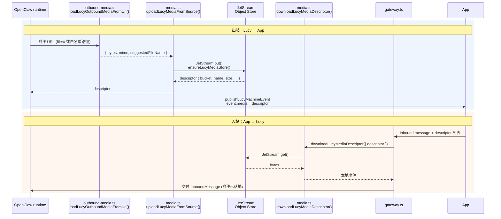
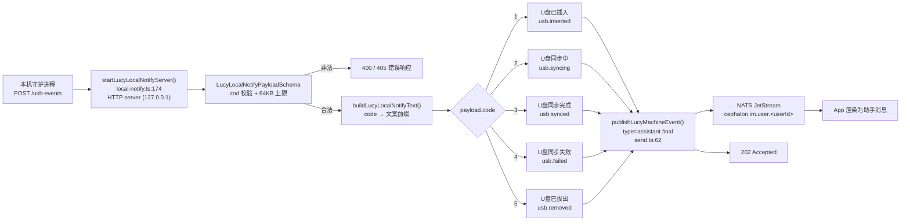

# Lucy 架构流程图索引

本文件是 Lucy 插件的流程图总索引。其他章节（如 `02-auth-binding`、`03-transport`、`05-model-provisioning` 等）会通过锚点直接引用这里的图，不要在各自章节里重复绘制同一张图。

所有图以代码为事实源，节点名尽量保留真实的导出函数名（英文）与所在文件，方便读图时直接跳到源码核对。下列 8 张图覆盖：系统分层、插件生命周期、绑定三态、入站消息时序、模型供应与自动重启、媒体上下行、USB 本地通知入口、审批事件 pending → applied。

---

## 1. 系统分层架构 {#diagram-system-layers}

这张图展示 Lucy 从 App 一路到 OpenClaw Gateway、再到本地持久化存储的完整分层关系。`@hzttt/lucy-ai-npc` 插件居于中间，对上承接 lucy-im-sdk-nodejs 暴露的连接能力，对下通过 OpenClaw 的 Plugin SDK 把消息交给 openclaw gateway 以及 cephalon provider。`user-center` 是绑定与模型配置的源头，NATS JetStream 是唯一的双向传输面。插件不直接访问 `presence.ts` 或 NATS WebSocket，这些都在 SDK 内部完成。



---

## 2. 插件生命周期 {#diagram-plugin-lifecycle}

这张图按时间顺序展示 OpenClaw 加载 `@hzttt/lucy-ai-npc` 时各个钩子的触发次序。`index.ts` 的默认导出通过 `defineLucyChannelPluginEntry()` 把 channel、命令、cephalon provider 一起注册；但真正阻塞直到 `abortSignal` 的是 `startLucyGateway()`。这条阻塞规则很关键 —— 如果任何环节提前 `return`，OpenClaw 会触发 "configured, works, stopped" 的自动重启。



---

## 3. 设备绑定三态 {#diagram-binding-states}

Lucy 的身份状态只有三种：未注册、待绑定、已绑定。状态迁移全部由 SDK 内部方法完成，插件只是调用者。PendingBind 期间，调用 SDK 的 `preBind()` 申请 OTP（一次性密码，有效期通常 60 秒），然后 `auth-qrcode.ts` 用 `buildLucyAuthQrUri(channelDeviceId, otp)` 拼成 `lucy://bind?channel_device_id=...&otp=...` URI，方便 App 扫码或 BLE 提取。OTP 不持久化；若过期需重新调用 `preBind()` 申请新 OTP。`cuk` 在 `pollBinding` 返回时写入 `/var/lib/lucy/identity/channel_ids/`，Ready 状态下再调用 `connect()` 才能拿到 NATS 通道。



---

## 4. 入站消息时序 {#diagram-inbound-sequence}

App 发出的一条 user 消息会经过 JetStream 订阅主题 `cephalon.im.npc.<user_id>.<cdi>` 投递到 `gateway.ts#handleLucyInboundMessage`，交给 OpenClaw runtime 跑模型；runtime 产生的每个 assistant chunk 都回到 `send.ts#publishLucyMachineEvent` 写入 `cephalon.im.user.<user_id>` 主题。图里标注的 `assistant.start / partial / final` 事件名和代码里的事件枚举对齐，用于客户端渲染流式气泡。

```mermaid
sequenceDiagram
    participant APP as App (iOS/Android)
    participant JS as NATS JetStream
    participant GW as gateway.ts<br/>handleLucyInboundMessage()
    participant RT as OpenClaw runtime<br/>(agents + model)
    participant SEND as send.ts<br/>publishLucyMachineEvent()

    APP->>JS: publish 到<br/>cephalon.im.user.&lt;user_id&gt;<br/>(user → npc 方向由 App 端负责)
    JS-->>GW: SDK subscribeChannel 拉取<br/>主题 buildNpcSubscribeSubject()
    Note over GW: nats.ts:3<br/>cephalon.im.npc.&lt;userId&gt;.&lt;cdi&gt;

    GW->>GW: 校验 channel_user_key<br/>解码 attachments
    GW->>SEND: inbound.accepted
    SEND-->>JS: buildNpcPublishSubject()<br/>cephalon.im.user.&lt;userId&gt;
    JS-->>APP: inbound.accepted

    GW->>RT: 投递 InboundMessage
    RT->>SEND: assistant.start
    SEND-->>APP: 通过 JetStream 回传
    loop 流式 token
        RT->>SEND: assistant.partial (text chunk)
        SEND-->>APP: 通过 JetStream 回传
    end
    RT->>SEND: assistant.final
    SEND-->>APP: 通过 JetStream 回传

    Note over GW,SEND: 所有出站事件统一经 publishLucyMachineEvent()<br/>(send.ts:62) 序列化为 JSON 并走 JetStream 发布
```

---

## 5. 模型供应与自动重启 {#diagram-provisioning-restart}

App 通过 `version=3 / kind=provision_model` 下发模型配置后，Lucy 先把 `cephalon` provider 写入 `models.providers`、再写 `agents.defaults.model.primary`，接着落盘一个重启票据并发出 `restart.scheduled`，由 `runCommandWithTimeout` 异步触发 `openclaw gateway restart`。重启后的新进程在 `startLucyGateway()` 再次连上 NATS 时，会读取票据并发出 `restart.completed` 通知 App 配置已生效。



---

## 6. 媒体上传与下载 {#diagram-media-transfer}

出站（Lucy → App）时，runtime 的附件可能是 `file://` URL 或本地路径，`outbound-media.ts` 先把它们加载为 Buffer，再经 `media.ts` 上传到 JetStream Object Store，最后 descriptor 塞进 `publishLucyMachineEvent` 的 `media` 字段。入站（App → Lucy）时，App 只传 descriptor，`gateway.ts` 在交给 runtime 前用 `downloadLucyMediaDescriptor()` 把字节拉回来。两端共用同一个 Object Store。



---

## 7. USB 本地通知入口 {#diagram-usb-local-notify}

机器侧的守护进程（例如 U 盘热插拔监听）会把 USB 事件 POST 到 Lucy 的本地 HTTP 端点，`startLucyLocalNotifyServer()` 按 `code` (1/2/3/4/5) 映射成固定的中文提示词，再用 `publishLucyMachineEvent` 以 `assistant.final` 形式发给 App。这是一条旁路，不经过 OpenClaw runtime，适合与业务消息无关的系统级提示。



---

## 8. 审批事件 pending → applied {#diagram-exec-approval}

OpenClaw runtime 在需要高危命令审批时会经 `operator-approvals` 控制面推送 `exec.approval.requested`，`LucyExecApprovalHandler` 把它转成 `approval.pending` 机器事件发给 App；与此同时，channel 主流程使用 `buildExecApprovalPendingReplyPayload()` 生成可见的提示文本。用户在 App 上选择 allow-once / allow-always / deny 之后，runtime 再推 `exec.approval.resolved`，Handler 把结果回放给 App，完成闭环。

```mermaid
sequenceDiagram
    participant RT as OpenClaw runtime<br/>operator-approvals
    participant H as LucyExecApprovalHandler<br/>exec-approvals-handler.ts:50
    participant CH as channel.ts<br/>dispatchReply
    participant HELP as exec-approval-helpers.ts<br/>buildExecApprovalPendingReplyPayload()
    participant SEND as publishLucyMachineEvent()
    participant APP as App
    participant USER as 用户

    RT->>H: evt = exec.approval.requested<br/>{ id, expiresAtMs, request }
    H->>H: resolveExecApprovalCommandDisplay()<br/>清理不可见字符
    H->>SEND: type=approval.pending<br/>approvalId / approvalSlug=id[0..8]<br/>approvalCommand / approvalHost / allowedDecisions
    SEND-->>APP: approval.pending (JSON)

    par 文本气泡
        CH->>HELP: buildExecApprovalPendingReplyPayload({<br/>approvalId, command, host, cwd, expiresAtMs })
        HELP-->>CH: ReplyPayload (text + channelData.execApproval)
        CH->>SEND: assistant.final (带 approval 元数据)
        SEND-->>APP: 提示文本 + /approve &lt;slug&gt; ... 按钮
    end

    APP->>USER: 展示 Approval required 气泡
    USER->>APP: 选择 allow-once / allow-always / deny
    APP-->>RT: 通过控制面下发决定
    RT->>H: evt = exec.approval.resolved<br/>{ id, decision, resolvedBy }
    H->>SEND: type=approval.resolved<br/>approvalDecision / approvalResolvedBy
    SEND-->>APP: approval.resolved（App 把气泡标为已处理）
```

---

## 维护约定

- 如果修改了上述任何节点引用的函数（名字、位置、行为），请回到这份文件同步更新；这是其它章节的引用源。
- 新图建议继续用 `{#diagram-...}` 锚点，其他章节用 `docs/01-overview/diagrams.md#diagram-...` 引用。
- 不要在图里引用已不存在的旧名：`buildLucySubjects`、`presence.ts`、`startLucyPresenceLoop`、`syncLucyBindingState`、`connectLucyNats`、`nats-websocket.ts`。
