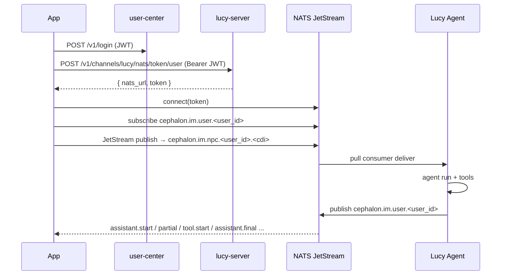

<!-- 最后核对：代码版本 ai-npc@2026.4.22，以 src/ 为事实源 -->

# App 接入指南

本文面向 iOS/Android/桌面客户端开发者，描述 Lucy Agent（OpenClaw 侧）与 App 之间的完整接入契约。内容以 `src/types.ts`（协议 Schema）、`src/nats.ts`（NATS 序列化）、`src/gateway.ts`（入站管线）、`src/channel.ts`（出站管线）为事实源。

## 通信模型

Lucy 是 **DM-only** 的 NATS JetStream agent：
- App 登录 user-center 获得 JWT → 再向 lucy-server 换 NATS token（300s TTL，单次）
- 用 token 连 NATS 集群
- **App 发给 Agent 的消息** 走 `cephalon.im.npc.<user_id>.<cdi>`（JetStream stream `IM_NPC`，Lucy 以 durable pull consumer `npc-<cdi>` 订阅）
- **Agent 发给 App 的事件** 走 `cephalon.im.user.<user_id>`（核心 NATS subject，App 用普通 subscribe 接收；多设备下同一 user_id 的所有设备都会收到）

> `user_id` 与 `cdi` 在绑定完成后由 user-center/lucy-im-sdk 持久化，App 通过 BLE `lucy_pairing_info` 特性或 QR 码获取 `cdi`，绑定后 user-center 回传 `cuk` 与 `user_id`。



## NATS 主题契约

| 方向 | 主题 | 发布方 | 订阅方 | 传输 |
|---|---|---|---|---|
| App → Agent | `cephalon.im.npc.<user_id>.<cdi>` | App | Lucy（JetStream pull consumer `npc-<cdi>` on stream `IM_NPC`） | **必须 JetStream publish** |
| Agent → App | `cephalon.im.user.<user_id>` | Lucy | App（普通 NATS subscribe 即可） | Core NATS（非 JetStream） |
| Presence（内部） | `cephalon.im.npc.<user_id>._discover` | lucy-im-sdk | 其他设备 | Core NATS |

关键点：
- App **发给 Agent** 必须用 JetStream 接口（`js.publish`），否则会被 stream 丢弃。
- App **接收 Agent 事件** 用普通 subscribe 就够了，Lucy 发布方没走 JetStream。
- 所有 NATS 请求都必须携带 lucy-server 颁发的 token（Ed25519 签名验证）。token 300 秒一次性，过期需重新换。

## 入站消息信封（App → Agent）

以 `LucyInboundMessageSchema` 为准，**camelCase 字段**。最新推荐版本为 **v4**（`src/types.ts:164`）：

```json
{
  "version": 4,
  "kind": "chat",
  "messageId": "2300000000009286727",
  "text": "给我把昨天那张截图发回来",
  "media": {
    "transport": "iroh-blob",
    "blob_ref": "blobab...",
    "kind": "image",
    "contentType": "image/png",
    "size": 11572,
    "fileName": "screenshot.png"
  },
  "attachments": [
    { "transport": "iroh-blob", "blob_ref": "blobab...", "kind": "image", "size": 8123 }
  ],
  "timestamp": 1776505507794,
  "metadata": { "clientLocale": "zh-CN" },
  "channelUserKey": "<cuk>",
  "channelDeviceId": "<cdi>"
}
```

字段详解：

| 字段 | 必填 | 说明 |
|---|---|---|
| `version` | ✅ | 目前支持 `1 \| 2 \| 3 \| 4`；新客户端请用 `4` |
| `kind` | v3+ | `"chat"`（普通聊天）或 `"provision_model"`（模型供应控制消息，见 `docs/05-model-provisioning/`） |
| `messageId` |  | 19 位十进制字符串（snowflake），App 未给时 Agent 会自动生成；**建议 App 自己生成以便追踪回执** |
| `text` | chat 类需至少有 `text` 或 `media`/`attachments` 之一 | 纯文本/Markdown |
| `media` |  | 单个附件；结构同下面 `LucyMediaDescriptor` |
| `attachments` | v4 | 多附件数组；v4 优于 `media`，两者可共存，Agent 会取 `min(len, maxAttachments)` |
| `timestamp` |  | 毫秒时间戳 |
| `metadata` |  | 任意字符串键值对，透传给 agent ctx |
| `channelUserKey` / `channelDeviceId` |  | 可写；**若填则必须与主题里的 `<user_id>`/`<cdi>` 命名空间一致**，否则 Agent 回一条 `error` 事件拒收 |
| `apiKey` / `deviceId` |  | v1 兼容别名（= `channelUserKey` / `channelDeviceId`） |

### `LucyMediaDescriptor`（媒体描述符）

所有媒体附件（入站或出站）统一用这个结构（`src/types.ts:21`）：

```json
{
  "transport": "iroh-blob",
  "blob_ref": "blobab...base32-encoded-ticket...",
  "kind": "image",
  "contentType": "image/png",
  "size": 11572,
  "fileName": "screenshot.png"
}
```

- `transport`：**固定为 `"iroh-blob"`**（历史遗留名，实际是 lucy-blob/iroh 的 P2P content-addressed 传输）
- `blob_ref`：iroh-blob ticket 字符串（`blob` 前缀 + base32）。任意 iroh-blob 客户端（Node/Kotlin/Swift SDK）用此 ticket 可拉取字节
- `kind`：`"image" \| "audio" \| "video" \| "document"`（用于 UI 分类显示）
- `contentType`：MIME 类型；可选
- `size`：字节数；必填
- `fileName`：建议保存名；可选

> 注意：过去文档里提到的 "JetStream Object Store / bucket / name" 已废弃。当前媒体只走 iroh-blob。

## 出站事件信封（Agent → App）

序列化层见 `src/nats.ts:11-81`。**字段混合命名**：`version`/`eventId`/`type`/`timestamp` 是 camelCase，`channel_user_key` 等多数字段是 snake_case。实际 JSON 长这样：

```json
{
  "version": 2,
  "eventId": "2045438467751886848",
  "type": "assistant.final",
  "timestamp": 1776505507794,
  "channel_user_key": "<cuk>",
  "channel_device_id": "<cdi>",
  "source_message_id": "2300000000009286727",
  "run_id": "c6a7541d-42c3-4c99-95bc-939ffbac555a",
  "session_key": "lucy:direct:<cuk>",
  "text": "这是你要的截图：",
  "media": {
    "transport": "iroh-blob",
    "blob_ref": "blobab...",
    "kind": "image",
    "contentType": "image/png",
    "size": 11572,
    "fileName": "screenshot.png"
  }
}
```

字段规则：

| 字段 | 命名 | 存在条件 |
|---|---|---|
| `version` | camelCase | 固定 `2` |
| `eventId` | camelCase | 每个事件一个 snowflake id |
| `type` | camelCase | 见下表 |
| `timestamp` | camelCase | 毫秒 |
| `channel_user_key` | snake_case | 始终有 |
| `channel_device_id` | snake_case | 始终有 |
| `source_message_id` | snake_case | 回指触发本次运行的 inbound `messageId`；**包括 agent 通过 `message send` 工具主动 push 的 assistant.final**（2026.4.22 起）。主动通知类（localNotify、restart、provisioning）无此字段 |
| `run_id` | snake_case | agent 本次 run 的 UUID；同 run 内多事件共享 |
| `session_key` | snake_case | OpenClaw session 路由键 |
| `text` | snake_case | 可选 |
| `tool_name` | snake_case | 仅 `tool.start` / `tool.end` |
| `metadata` | snake_case | 可选 object |
| `media` | snake_case | 单个 `LucyMediaDescriptor`（含两级字段 `transport/blob_ref/kind/contentType/size/fileName`） |
| `approval*` | **双发** camelCase + snake_case | approval 事件同一值两种命名都发，兼容老客户端 |

> ⚠️ 当前出站序列化器 **只输出 `media`，不输出 `attachments`**。若 agent 带多附件，只有第一个通过 `media` 到 App。这是 `src/nats.ts:25` 的已知限制，后续扩展需要同步 Kotlin/Swift SDK。

### 事件类型枚举（`LucyMachineEventType`，见 `src/types.ts:217-233`）

| `type` | 语义 | 主要字段 |
|---|---|---|
| `inbound.accepted` | 入站消息通过 schema + 命名空间校验 | `source_message_id`, `session_key` |
| `assistant.start` | 本轮模型回复块开始（partial 流之前会先发 start） | `source_message_id`, `run_id` |
| `assistant.partial` | 流式文本增量 | `text`（累积文本） |
| `assistant.final` | 模型回复块结束；可能带 `media` | `text` 和/或 `media`，`source_message_id`, `run_id` |
| `reasoning.partial` | 思考流（仅部分模型） | `text` |
| `reasoning.final` | 思考流结束 | — |
| `tool.start` | Agent 调用工具前 | `tool_name` |
| `tool.end` | 工具调用结束 | `tool_name` |
| `error` | 入站校验失败或 agent 抛错 | `text`（错误文本），`metadata.issues[]` |
| `approval.pending` | 需要用户审批命令执行 | `approval_id/slug/command/cwd/host/expires_at_ms/allowed_decisions`（双命名）|
| `approval.resolved` | 审批结果已处理 | `approval_id`, `approval_decision`, `approval_resolved_by` |
| `config.updated` | 供应/配置写入成功 | `text`（描述） |
| `config.error` | 供应/配置失败 | `text`（错误） |
| `restart.scheduled` | 重启票据已下发 | `metadata`（票据信息） |
| `restart.completed` | 重启后在线确认 | — |

> 文档历史版本提到的 `inbound.rejected` 和 `usb.*` 类事件 **不存在**；前者走 `type: "error"`，USB 通知走 `assistant.final`（见 `src/local-notify.ts`）。

## 典型消息流

### 纯文本聊天

```
App →  npc.<u>.<d>  { version:4, kind:"chat", messageId:M1, text:"hi" }

App ←  user.<u>     inbound.accepted   source_message_id=M1
App ←  user.<u>     assistant.start    source_message_id=M1  run_id=R1
App ←  user.<u>     assistant.partial  text:"hi"
App ←  user.<u>     assistant.partial  text:"hi there"
App ←  user.<u>     assistant.final    text:"hi there"        source_message_id=M1  run_id=R1
```

### Agent 返回图片（工具调用走 `message send` 产生）

```
App →  npc.<u>.<d>  { version:4, kind:"chat", messageId:M2, text:"把截图发我" }

App ←  user.<u>     inbound.accepted   source_message_id=M2
App ←  user.<u>     assistant.start    source_message_id=M2  run_id=R2
App ←  user.<u>     tool.start         tool_name:"message"   source_message_id=M2  run_id=R2
App ←  user.<u>     assistant.final    media:{transport:"iroh-blob",blob_ref:"...",kind:"image",...}
                                       source_message_id=M2  run_id=R2
```

App 收到带 `media` 的 `assistant.final` 后，使用 lucy-blob SDK（Kotlin: `lucy-im-sdk-kotlin`，Swift: `lucy-im-sdk-swift`）用 `blob_ref` ticket 拉取字节：

```kotlin
// Kotlin/Android
val bytes = lucySdk.blobFetch(descriptor.blob_ref)
```

```swift
// Swift/iOS
let data = try await lucyClient.blobFetch(descriptor.blob_ref)
```

### App 上传附件给 Agent

```
// 1. App 先用 iroh-blob SDK 把字节 put 进本地 store，得到 blob_ref
val session = lucySdk.blobPut(bytes, "screenshot.png")

// 2. 在消息里引用 descriptor
App → npc.<u>.<d> {
  version: 4, kind: "chat", messageId: M3,
  text: "分析一下这张截图",
  attachments: [{
    transport: "iroh-blob",
    blob_ref: session.blobRef,
    kind: "image",
    contentType: "image/png",
    size: bytes.size,
    fileName: "screenshot.png"
  }]
}

// 3. Agent 会自动从 iroh-blob 下载、落盘到 mediaLocalRoots、喂给模型
```

## 接入自检清单

### 绑定阶段
- [ ] 从 BLE 或 QR 码获得 `cdi`
- [ ] `user-center` 登录/注册设备拿到 JWT
- [ ] 绑定流程拿到 `cuk` + `user_id`

### NATS 连接
- [ ] 向 `lucy-server` POST `/v1/channels/lucy/nats/token/user`（Bearer JWT）换到 `token` + `nats_url`
- [ ] 用 token 连 NATS（注意 300s TTL）
- [ ] Core subscribe `cephalon.im.user.<user_id>`
- [ ] JetStream publish 到 `cephalon.im.npc.<user_id>.<cdi>`（不是 core publish）

### 入站消息
- [ ] 消息 JSON 符合 v4 schema；`kind: "chat"`；`messageId` 是 19 位十进制；`channelUserKey/channelDeviceId` 与主题一致
- [ ] 附件走 `attachments: []`（优先）或 `media: {}`（单个）；descriptor.`transport: "iroh-blob"`，`blob_ref` 有效

### 出站事件
- [ ] 解析 `type` 路由分发
- [ ] 用 `source_message_id` 把事件关联到对应 inbound 消息（**即使是 `message send` 工具 push 的 final，也有这个字段**；localNotify/主动通知则无）
- [ ] 用 `run_id` 聚合同一轮内的事件
- [ ] 展示 `assistant.partial` 流式增量
- [ ] 处理 `tool.start`/`tool.end`、`reasoning.*` 事件

### 媒体
- [ ] 读取 `media.transport` 判定为 `"iroh-blob"`
- [ ] 用 `blob_ref` 通过本地 iroh-blob SDK 拉取字节
- [ ] 兼容 `contentType`/`fileName` 缺省的情况

### 错误与恢复
- [ ] `type: "error"` 展示 `text`
- [ ] NATS 断线重连 + token 过期时重新换 token
- [ ] `approval.pending` 弹窗，把决策结果通过 ExecApproval 反向 RPC（或后续版本定义的主题）回传

## 相关文档

- NATS 主题与 JetStream：[../03-transport/nats-subjects.md](../03-transport/nats-subjects.md)
- 机器事件详解：[../04-messaging/machine-events.md](../04-messaging/machine-events.md)
- 媒体传输（iroh-blob）：[../06-media/](../06-media/)
- BLE 配对信息导出：[./ble-pairing-export.md](./ble-pairing-export.md)
- USB 本地通知：[./usb-local-notify.md](./usb-local-notify.md)
- 绑定与认证流程：[../02-auth-binding/integrated-flow.md](../02-auth-binding/integrated-flow.md)
